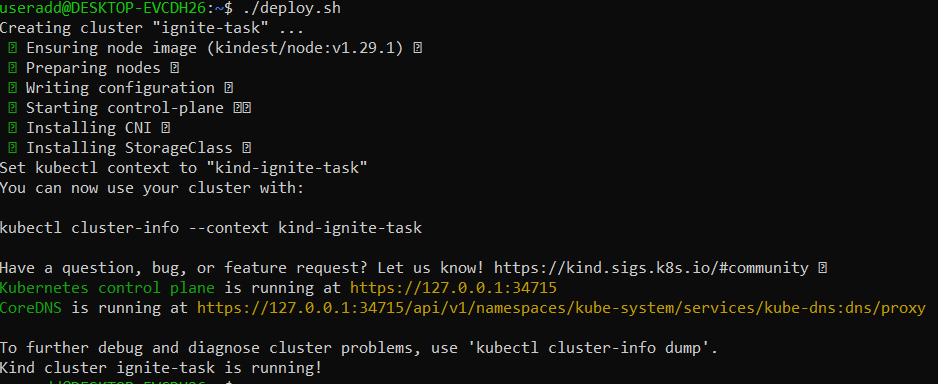

# Ignite-Dev-Assessment
- Setup a kubernetes cluster using kind
1. Install kind
```
    [ $(uname -m) = x86_64 ] && curl -Lo ./kind https://kind.sigs.k8s.io/dl/v0.22.0/kind-linux-amd64
    chmod +x ./kind
    sudo mv ./kind /usr/local/bin/kind
    kind --version
```

2. [Install docker engine](https://docs.docker.com/engine/install/ubuntu/)

3. [Install kubectl](https://kubernetes.io/docs/tasks/tools/install-kubectl-linux/)

- Write a bash script that deploys a kind cluster

- Download the kubeconfig for the cluster and store it.
    
    `kubectl config view --minify --raw > kubeconfig.yml` 

- Deploy a Node.js app using terraform
    1. Login into your docker hub account
    
    2. Create a directory and enter into it
    3. Create an app.js file and write your code for your node.js application inside the directory you created.
    4. Create a Dockerfile and write your docker configurations inside the file.
    5. Docker your application and view it on your browser
    
    
    6. Push your image
    
- Deploy the docker container using terraform
    1. Create a kubernetes deployment manifest to deploy the Node.js to the kind cluster
    2. Use the kubectl terraform provider to write a terraform code to deploy the kubectl manifest to the kind cluster
    
    
    
## Bonus task
- Install helm
    1. Get the help repo information and install afterwards
``` 
    helm repo add prometheus-community https://prometheus-community.github.io/helm-charts
    helm repo update
    helm install prometheus prometheus-community/prometheus
```

- Get your pods and get your services
- Create a nodeport service and expose it


- Get the url and paste to your browser 
